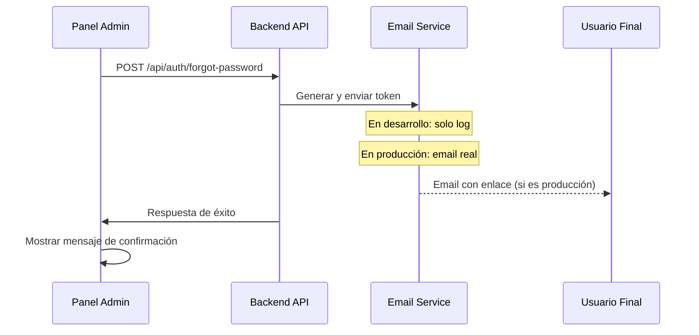

# Corrección del Sistema de Reset de Contraseñas

## Problema Identificado

Al intentar enviar emails de recuperación de contraseña desde el panel de administración, se producían dos errores principales:

1. **Error de tipo de parámetro en HttpError:**
   ```
   TypeError: Invalid status code: "Error al procesar solicitud de recuperación". 
   Status code must be an integer.
   ```

2. **Error de dominio no verificado en Resend:**
   ```
   Error sending email: The tudominio.com domain is not verified. 
   Please, add and verify your domain on https://resend.com/domains
   ```

## Causas del Problema

### 1. Parámetros Invertidos en HttpError

La clase `HttpError` espera los parámetros en este orden: `statusCode` (número), `message` (string), pero en varios lugares se estaban pasando invertidos:

```javascript
// ❌ Incorrecto
throw new HttpError('Error al procesar solicitud de recuperación', 500);

// ✅ Correcto
throw new HttpError(500, 'Error al procesar solicitud de recuperación');
```

### 2. Dominio de Email No Verificado

El servicio intentaba enviar emails desde dominios no verificados en Resend.

## Solución Implementada

### 1. Corrección de Parámetros HttpError

**Archivos corregidos:**
- `backend/src/routes/passwordReset.js`
- `backend/src/services/passwordResetService.js`

**Cambios realizados:**
```javascript
// Antes
throw new HttpError('Email es requerido', 400);
throw new HttpError('Error al procesar solicitud de recuperación', 500);

// Después
throw new HttpError(400, 'Email es requerido');
throw new HttpError(500, 'Error al procesar solicitud de recuperación');
```

### 2. Configuración de Email para Desarrollo

**Archivo:** `backend/src/services/emailService.js`

**Mejoras implementadas:**

- **Modo desarrollo:** En lugar de enviar emails reales, el sistema ahora muestra la información en consola
- **Dominio verificado:** Uso del dominio `onboarding@resend.dev` para evitar errores de verificación
- **Logs detallados:** Información completa del email que se habría enviado

```javascript
// Ejemplo de log en modo desarrollo
📧 [DEV MODE] Password Reset Email:
   To: usuario@ejemplo.com
   Token: abc123...
   Reset URL: http://localhost:3001/reset-password?token=abc123...
   User: Juan Pérez
```

### 3. Mejoras en el Frontend

**Archivo:** `frontend-admin/src/modules/users/pages/UsersPage.jsx`

**Funcionalidades agregadas:**

- **Mensajes de éxito:** Confirmación visual cuando el email se envía correctamente
- **Manejo específico de errores:** Diferentes mensajes según el tipo de error HTTP
- **Auto-ocultamiento:** Los mensajes desaparecen automáticamente después de unos segundos
- **Iconografía moderna:** Uso de Lucide React para íconos de estado

### 4. Actualización de Variables de Entorno

**Archivo:** `.env`

```properties
# Antes
FROM_EMAIL=manuel.altersantos@gmail.com

# Después
FROM_EMAIL=onboarding@resend.dev
```

## Estructura del Sistema de Reset

### 1. Flujo de Recuperación



### 2. Endpoints de Password Reset

| Endpoint | Método | Descripción |
|----------|--------|-------------|
| `/api/auth/forgot-password` | POST | Solicita token de recuperación |
| `/api/auth/validate-reset-token` | POST | Valida si un token es válido |
| `/api/auth/reset-password` | POST | Cambia contraseña con token |
| `/api/auth/clean-expired-tokens` | DELETE | Limpia tokens expirados |

### 3. Validaciones Implementadas

- **Email requerido:** Verificación de presencia del email
- **Token válido:** Validación de existencia y expiración
- **Contraseña segura:** Mínimo 6 caracteres
- **Token único:** Solo un token activo por usuario
- **Expiración:** Tokens válidos por 15 minutos

## Configuración para Diferentes Entornos

### Desarrollo (NODE_ENV=development)
- Los emails se muestran en consola
- Uso de dominio verificado de Resend
- Logs detallados para debugging

### Producción (NODE_ENV=production)
- Emails reales enviados a usuarios
- Dominio personalizado verificado
- Logs minizados de seguridad

## Características de Seguridad

1. **Tokens únicos:** Cada solicitud invalida tokens previos
2. **Expiración corta:** 15 minutos máximo de validez
3. **Uso único:** Tokens se marcan como usados después del cambio
4. **Invalidación de sesiones:** Al cambiar contraseña se cierran todas las sesiones activas
5. **Logs de auditoría:** Registro completo de operaciones

## Para Probar el Sistema

### 1. Reiniciar el Backend
```bash
docker-compose restart backend
```

### 2. Probar desde el Panel Admin
1. Ir a "Usuarios" en el panel admin
2. Seleccionar un usuario
3. Hacer clic en "Restablecer Contraseña"
4. Verificar mensaje de éxito
5. Revisar logs en Docker para ver el token generado

### 3. Verificar Logs de Desarrollo
```bash
docker-compose logs backend
```

Buscar líneas que contengan `[DEV MODE] Password Reset Email` para ver la información del email que se habría enviado.

## Próximos Pasos

1. **Configurar dominio propio:** Para producción, configurar y verificar dominio personalizado en Resend
2. **Templates de email:** Mejorar el diseño HTML de los emails
3. **Rate limiting:** Implementar límites de intentos por IP/usuario
4. **Métricas:** Agregar tracking de éxito/fallo de envíos
5. **Testing:** Crear tests automatizados para todos los endpoints