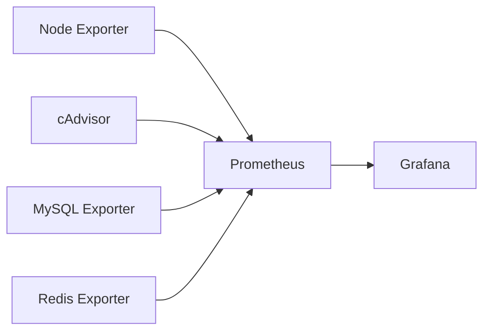

# 📊 Monitoring Stack — E-Commerce Platform

Este repositorio incluye una pila de monitoreo para la plataforma E-Commerce, utilizando **Prometheus**, **Grafana** y múltiples exporters para recolectar métricas del sistema, contenedores y servicios críticos (MySQL + Redis).

---

## 🧩 Componentes

| Servicio | Función | Puerto |
|---------|--------|-------|
| **Prometheus** | Recolección de métricas | `32090 → 9090` |
| **Node Exporter** | Métricas del host (CPU, RAM, FS) | `32100 → 9100` |
| **cAdvisor** | Métricas de contenedores Docker | `32081 → 8080` |
| **MySQL Exporter** | Métricas de MySQL | `32104 → 9104` |
| **Redis Exporter** | Métricas de Redis | `32121 → 9121` |
| **Grafana** | Dashboards de visualización | `32300 → 3000` |

---

## 🚀 Levantar el Stack

```bash
docker compose up -d prometheus grafana node_exporter cadvisor mysqld-exporter redis-exporter
```

---

## 🌐 Accesos

| Servicio | URL |
|---------|-----|
| Prometheus | http://localhost:32090 |
| Grafana | http://localhost:32300 |
| Node Exporter | http://localhost:32100/metrics |
| cAdvisor | http://localhost:32081 |
| MySQL Exporter | http://localhost:32104/metrics |
| Redis Exporter | http://localhost:32121/metrics |

---

## 🧠 Arquitectura



---

## 📑 Notas

- Mantener dashboards dentro de `/monitoring/grafana/dashboards`

